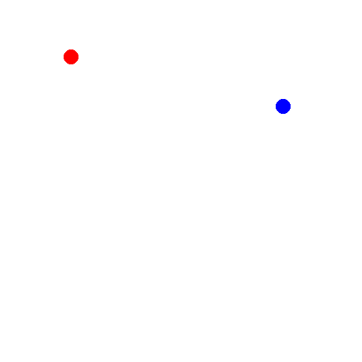
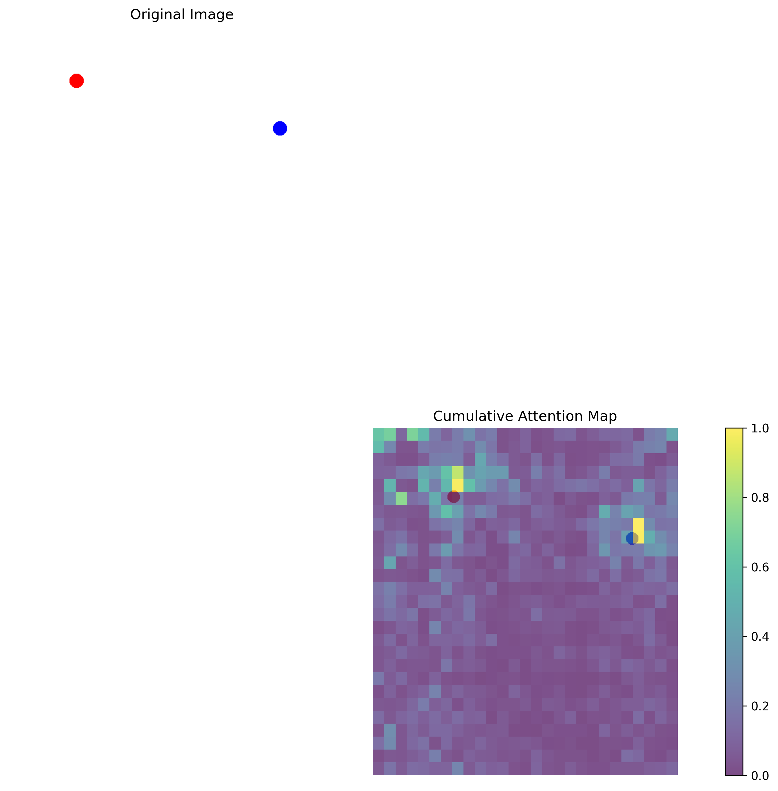

# Klarity on bwHPC
## Overview

Klarity is a toolkit for inspecting AI decision-making processes.
It provides intuitive and visual insights into how models reason about inputs.

Klarity computes:
* Attention & Visual Alignment Maps – visualize where models focus
* Uncertainty & Entropy – measure model confidence
* Semantic Clustering – detect patterns and anomalies

⚠️ Note: Klarity requires a together.ai account. Running Klarity on models incurs usage costs.

For more detailed documentation on Klarity, visit the official repo: (https://github.com/klara-research/klarity)

## Example: Attention Visualization
### Input Image & Prompt
<table style="border: none; border-collapse: collapse;"> <tr> <td style="border: none; padding: 5px;"> <strong>Prompt:</strong> <em>What do you see?</em><br> <strong>Answer:</strong> <em>In the image provided, there are two distinct points — one red and one blue — located in the middle of a white background. The red point appears slightly closer to the blue point.</em> </td> <td style="border: none; padding: 5px;">  </td> </tr> </table>

### Attention Heatmap
The attention heatmap below illustrates how the model focuses on specific regions of the input image during token generation.

<p align="center">  </p>

## Quickstart & Usage
### 1. Environment Setup

For usage on bwHPC, follow the environment setup instructions in the [Medical_Imaging repository](https://github.com/DeveloperNomis/Medical_Imaging).


After setting up your environment, install dependencies:
```bash
pip install -r requirements.txt
```

### 2. Klarity Installation

#### 1. Install Klarity directly from GitHub:
```bash
pip install git+https://github.com/klara-research/klarity.git
```

#### 2.Manual Checks / Adjustments

Locate the Klarity installation directory (e.g.):
```bash
/pfs/work9/workspace/scratch/username-workspace_name/conda/lib/python3.10/site-packages/klarity
```

Ensure the schemas directory exists.

In src/klarity/core/analyzer.py, go to line 648 (def _create_attention_visualization(...))
and replace the function with the following:
```bash
    def _create_attention_visualization(
        self,
        image: Image.Image,
        attention_data: AttentionData,
    ) -> Image.Image:
        """Create visualization of attention overlay and return as PIL Image"""
        import os
        import tempfile

        fixed_path = "/your/path/to/save/the/results/attention_visualization.png"
        self.visualize_attention(attention_data, image, fixed_path)
        viz_image = Image.open(fixed_path)
        return viz_image
```

Note: Update fixed_path to your desired output directory.

Go to https://api.together.ai/
 and create an account to obtain your API key.

### 3. Configuration

Edit the following fields in Klarity_VLM.py:
* insight_model
* insight_api_key
* image_path
* question
* output_path

Optional: You can also adjust parameters such as max_new_tokens or others within the same script.

### 4. Run the Attention Extraction

Execute the main script to generate the visualization:
```bash
python Klarity_VLM.py
```


<p align="center">
  <i>Thanks for visiting! Contributions and stars are always welcome ⭐</i>
</p>

