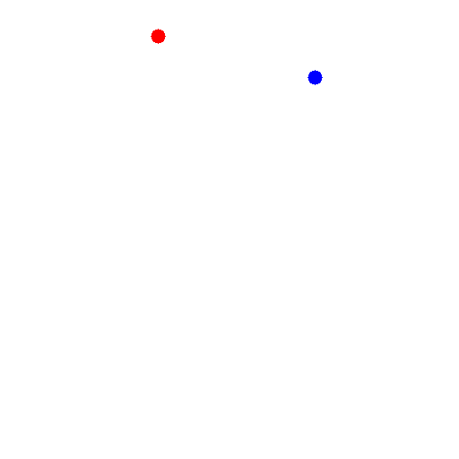
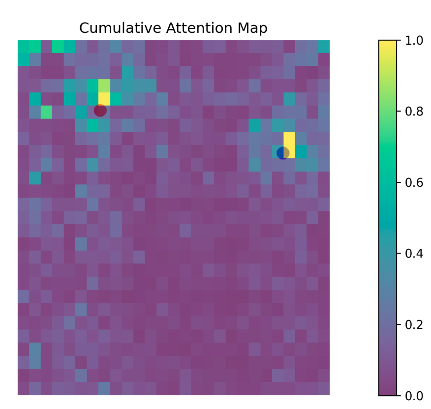

# Klarity on bwHPC


## Table of Contents 
1. [Overview](#1-overview)
2. [Example: Attention Visualization](#2-example-attention-visualization)
3. [Quickstart & Usage](#3-quickstart--usage)
   1. [Environment Setup](#1-environment-setup)
   2. [Klarity Installation](#2-klarity-installation)
   3. [Setup together.ai](#3-setup-togetherai)
   4. [Configuration](#4-configuration)
   5. [Run the Attention Extraction](#5-run-the-attention-extraction) 

## 1. Overview

This repository provides a step-by-step guide for installing, configuring, and running **Klarity** on the **bwHPC cluster**.

Klarity is a toolkit for inspecting AI decision-making processes.
It provides intuitive and visual insights into how models reason about inputs.

Klarity features:
* **Attention & Visual Alignment Maps** – visualize where models focus
* **Uncertainty & Entropy** – measure model confidence
* **Semantic Clustering** – detect patterns and anomalies


⚠️ Note: Klarity requires a together.ai account. Running Klarity on models incurs usage costs. ⚠️

For more detailed documentation on Klarity, visit the official repo: https://github.com/klara-research/klarity

## 2. Example: Attention Visualization

**Prompt:**  
> *What do you see?*

**Model Answer:**  
> In the image provided, there are two distinct points — one red and one blue — located in the middle of a white background. The red point appears slightly closer to the blue point.


### Attention Heatmap
The attention heatmap below illustrates how the model focuses on the two dots in the image.


<p 
</kbd>
   align="center" style="display: flex; justify-content: center; gap: 20px; flex-wrap: wrap;">
  
  
</kbd>
</p>

## 3. Quickstart & Usage
### 1. Environment Setup

Follow the environment setup instructions in the [Medical_Imaging repository](https://github.com/DeveloperNomis/Medical_Imaging).

After setting up your environment, install dependencies:
```bash
pip install -r requirements.txt
```

### 2. Klarity Installation

#### 1. Install Klarity directly from GitHub:
```bash
pip install git+https://github.com/klara-research/klarity.git
```

#### 2. Manual Checks / Adjustments

Locate the Klarity installation directory (e.g.):
```bash
/path/to/your/conda/lib/python3.10/site-packages/klarity
```

Ensure the schemas directory exists.

In klarity/core/analyzer.py, go to: line 648 (def _create_attention_visualization(...))
and replace the function with the following:
```bash
    def _create_attention_visualization(
        self,
        image: Image.Image,
        attention_data: AttentionData,
    ) -> Image.Image:
        """Create visualization of attention overlay and return as PIL Image"""
        import os
        import tempfile

        fixed_path = "/your/path/to/save/the/results/attention_visualization.png"
        self.visualize_attention(attention_data, image, fixed_path)
        viz_image = Image.open(fixed_path)
        return viz_image
```

Note: Update fixed_path to your desired output directory.

#### 3. Setup together.ai 
Go to https://api.together.ai/ and create an account to obtain your API key. Take note of the API key for future use. 

#### 4. Configuration

In `Klarity_VLM.py`, edit the following fields:

| **Field**           | **Description** |
|----------------------|-----------------|
| `insight_model`      | Model name used for Klarity |
| `insight_api_key`    | Your together.ai API key |
| `image_path`         | Path to the input image |
| `question`           | Model query or prompt |
| `output_dir`         | Directory to save results |

*Optional:* You can also adjust parameters such as `max_new_tokens` or others within the same script.

#### 5. Run the Attention Extraction

Execute the main script to generate the attention output:
```bash
python Klarity_VLM.py
```


<p align="center">
  <i>Thanks for visiting! Contributions and stars are always welcome ⭐</i>
</p>


